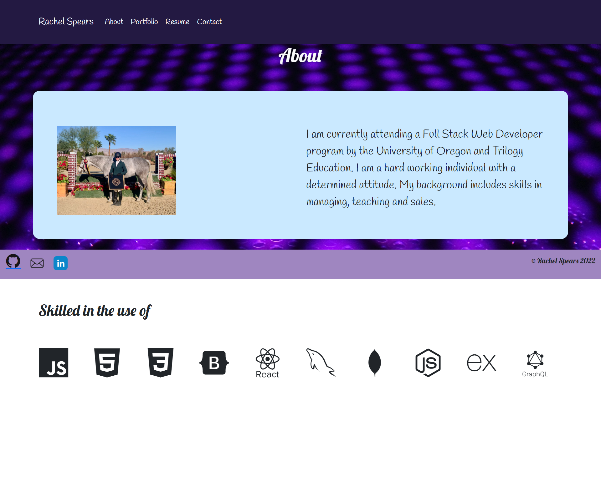

### Table of Contents

1. [Description](#description)
2. [Built With](#built-with)
3. [Deployed Website](#deployed-website)
4. [Screenshot](#screenshot)
5. [Acknowledgments](#acknowledgments)
6. [Questions](#questions)

## Description

This project is a page built in React to be my portfolio page. 

### Built With

* JavaScript
* React
* HTML
* CSS
* Bootstrap
* React Bootstrap

## Deployed website

https://rosepetal2022.github.io/React-portfolio-page/

## Screenshot

## Acknowledgments

* Coolers (A color generator website)
* Pexels (Free images)
* Google Fonts library
* Devicon 

## Questions

  If you have any questions please contact me by email or GitHub.

  Email: marcotter25@yahoo.com

  GitHub: https://github.com/Rosepetal2022

(<a href="#top">back to top</a>)

